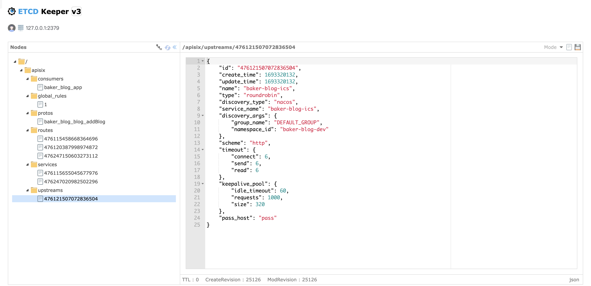

# 📖 名词解释


# 📊 数据




## 1、路由直接指定上游

**/apisix/routes/476115458668364696**

```json
{
    "id": "476115458668364696",
    "create_time": 1693316527,
    "update_time": 1693320223,
    "name": "管理员添加博客",
    "labels": {
        "API_VERSION": "v1",
        "auth": "admin"
    },
    "desc": "管理员添加博客",
    "status": 1,
    "host": "*.baker-yuan.cn",
    "uri": "/blog/admin/addBlog",
    "methods": [
        "POST"
    ],
    "plugins": {
        "basic-auth": {
            "_meta": {
                "disable": false
            }
        }
    },
    "upstream": {
        "type": "roundrobin",
        "discovery_type": "nacos",
        "service_name": "baker-blog-blog",
        "discovery_args": {
            "group_name": "DEFAULT_GROUP",
            "namespace_id": "baker-blog-dev"
        },
        "scheme": "http",
        "timeout": {
            "connect": 6,
            "send": 6,
            "read": 6
        },
        "keepalive_pool": {
            "idle_timeout": 60,
            "requests": 1000,
            "size": 320
        },
        "pass_host": "pass"
    }
}
```


## 2、路由指定服务Id&服务直接指定上游

### 服务直接指定上游

**/apisix/services/476115655045677976**

```json
{
    "id": "476115655045677976",
    "create_time": 1693316644,
    "update_time": 1693316644,
    "name": "baker-blog-blog",
    "hosts": [
        "*.baker-yuan.cn"
    ],
    "upstream": {
        "type": "roundrobin",
        "discovery_type": "nacos",
        "service_name": "baker-blog-blog",
        "discovery_args": {
            "group_name": "DEFAULT_GROUP",
            "namespace_id": "baker-blog-dev"
        },
        "scheme": "http",
        "timeout": {
            "connect": 6,
            "send": 6,
            "read": 6
        },
        "keepalive_pool": {
            "idle_timeout": 60,
            "requests": 1000,
            "size": 320
        },
        "pass_host": "pass"
    }
}
```


### 路由指定服务Id

**/apisix/routes/476120387998974872**

```bash
{
    "id": "476120387998974872",
    "create_time": 1693319465,
    "update_time": 1693320041,
    "name": "管理员删除博客",
    "service_id": "476115655045677976",
    "status": 1,
    "host": "*.baker-yuan.cn",
    "uri": "/blog/admin/deleteBlog",
    "methods": [
        "DELETE"
    ],
    "plugins": {
        "basic-auth": {
            "_meta": {
                "disable": false
            }
        }
    }
}
```


## 3、路由指定服务id&服务指定上游id

### 上游

**/apisix/upstreams/476121507072836504**

```bash
{
    "id": "476121507072836504",
    "create_time": 1693320132,
    "update_time": 1693320132,
    "name": "baker-blog-ics",
    "type": "roundrobin",
    "discovery_type": "nacos",
    "service_name": "baker-blog-ics",
    "discovery_args": {
        "group_name": "DEFAULT_GROUP",
        "namespace_id": "baker-blog-dev"
    },
    "scheme": "http",
    "timeout": {
        "connect": 6,
        "send": 6,
        "read": 6
    },
    "keepalive_pool": {
        "idle_timeout": 60,
        "requests": 1000,
        "size": 320
    },
    "pass_host": "pass"
}
```


### 服务指定上游id

**/apisix/services/476247020982502296**

```bash
{
    "id": "476247020982502296",
    "create_time": 1693394945,
    "update_time": 1693394945,
    "name": "baker-blog-ics",
    "hosts": [
        "*.baker-yuan.cn"
    ],
    "upstream_id": "476121507072836504"
}
```


### 路由指定服务id

**/apisix/routes/476247150603273112**

```bash
{
    "id": "476247150603273112",
    "create_time": 1693395022,
    "update_time": 1693395022,
    "name": "添加博客评论",
    "labels": {
        "API_VERSION": "v1"
    },
    "service_id": "476247020982502296",
    "status": 1,
    "uri": "/ics/addComment",
    "methods": [
        "POST"
    ]
}
```


## 4、全局过滤器

**/apisix/global_rules/1**

```bash
{
    "id": "1",
    "create_time": 1693319550,
    "update_time": 1693319550,
    "plugins": {
        "cors": {
            "_meta": {
                "disable": false
            },
            "allow_credential": false,
            "allow_headers": "*",
            "allow_methods": "*",
            "allow_origins": "*",
            "expose_headers": "*",
            "max_age": 5
        }
    }
}
```


## 5、消费者

> https://apisix.apache.org/zh/docs/apisix/terminology/consumer/

**/apisix/consumers/baker_blog_app**

```bash
{
    "username": "baker_blog_app",
    "desc": "baker_blog_app",
    "plugins": {
        "basic-auth": {
            "_meta": {
                "disable": false
            },
            "password": "baker",
            "username": "baker"
        }
    },
    "create_time": 1693405862,
    "update_time": 1693405870
}
```


## 6、proto协议

**/apisix/protos/baker_blog_blog_addBlog**

```bash
{
    "id": "baker_blog_blog_addBlog",
    "create_time": 1693319713,
    "update_time": 1693319713,
    "desc": "添加博客pb",
    "content": "syntax = \"proto3\";\n\noption go_package = \"google.golang.org/grpc/examples/helloworld/helloworld\";\noption java_multiple_files = true;\noption java_package = \"io.grpc.examples.helloworld\";\noption java_outer_classname = \"HelloWorldProto\";\n\npackage helloworld;\n\n// The greeting service definition.\nservice Greeter {\n  // Sends a greeting\n  rpc SayHello (HelloRequest) returns (HelloReply) {}\n}\n\n// The request message containing the user's name.\nmessage HelloRequest {\n  string name = 1;\n}\n\n// The response message containing the greetings\nmessage HelloReply {\n  string message = 1;\n}\n"
}
```

